# Pizza-Delivery
Progressive Web Application using Angular 16.

This Angular app is a progressive web app that has the below Features:
1. Runs offline
2. Push Notification feature
3. Add to Home Screen (Installs on your mobile as a native app like any other Android app).


## Setup and Installation

This project was generated with [Angular CLI](https://github.com/angular/angular-cli) version 16.0.4.

1. **Clone the repo from GitHub**
   ```sh
   git clone  https://github.com/vishesh-mahale/Angular-PWA-Firestore-CRUD.git
   cd Angular-PWA-Firestore-CRUD
   npm install
   ```

2.  **Take Production Build**
 ```sh
  npm run build-deploy
  ```
   The above command will build the application and it will also deploy your application to Firebase.


## Demo
The Angular PWA app is deployed on Firebase. 
https://pwa-app-1234.web.app/

## NOTE
The Server side code(NodeJS, ExpressJS, Firebase cloud messaging, Firestore) for supporting this Angular App is available at  https://github.com/vishesh-mahale/PWA-Firestore-CRUD-NodeJs-ExpressJS. Please refer to the README.md file of the server-side code to access the Rest APIs.

## Goal

This project is mainly aimed to Showcase the feature of PWA using the powerful framework Angular. 
It has also used Node.JS, ExpressJS, CRUD, Firestore(Firebase), and REST APIs.

## Tech Stack
 	1. Angular 16
	2. Node.JS  
	3. ExpressJS
	4. REST APIs
	5. Firebase: Firestore
    6. Firebase cloud messaging
    7. Chrome Browser
    8. Postman
    9. VS code

## Comments
The Pizza-Delivery App can be reused in any Angular Project as a Template that needs PWA Features.

## Screenshots

**How to use the Application:**
Open the application in your browser https://pwa-app-1234.web.app/

**Add to Home screen Feature:**
Once you open the application in your browser you will get a notification asking for the installation of the web app on your device. 
<br><br>
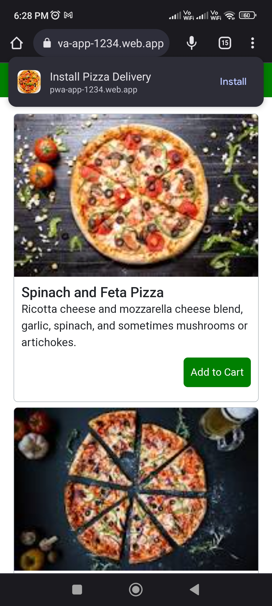

Once you click on Install it will again ask you for reconfirmation to Install the PWA app.
<br><br>
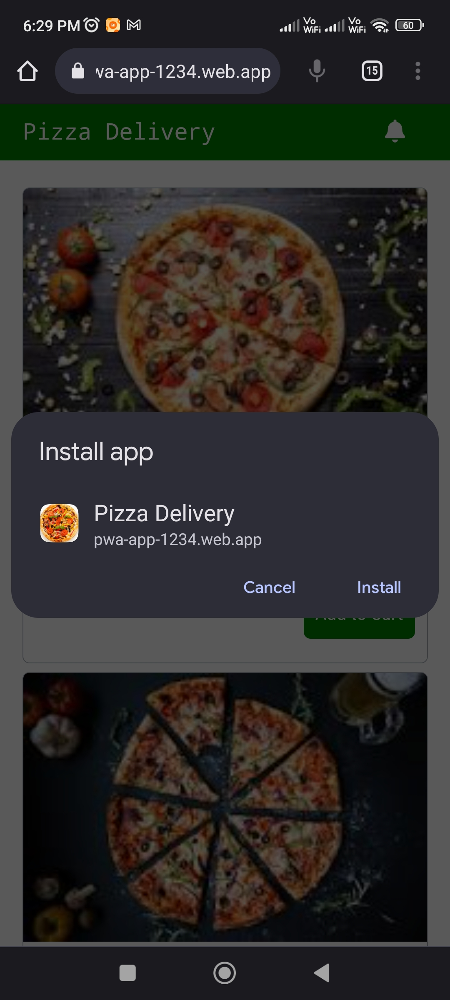

Once click on Install it will install the app and then check for a security scan and ask you to open an application.
<br><br>
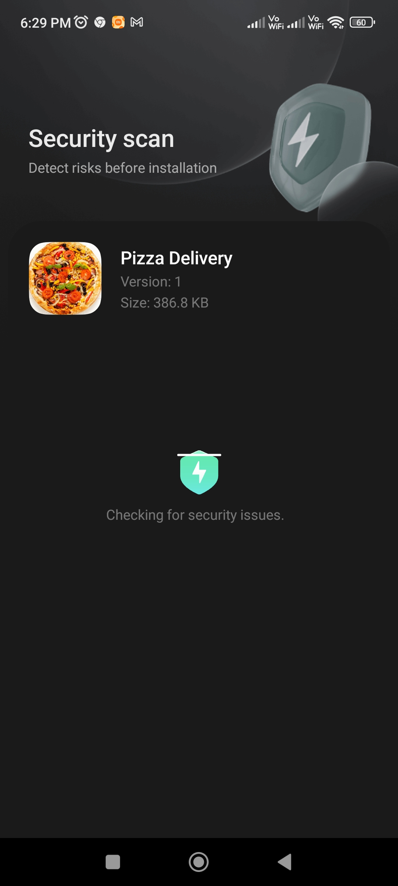

Upon clicking on open the will start like below
<br><br>
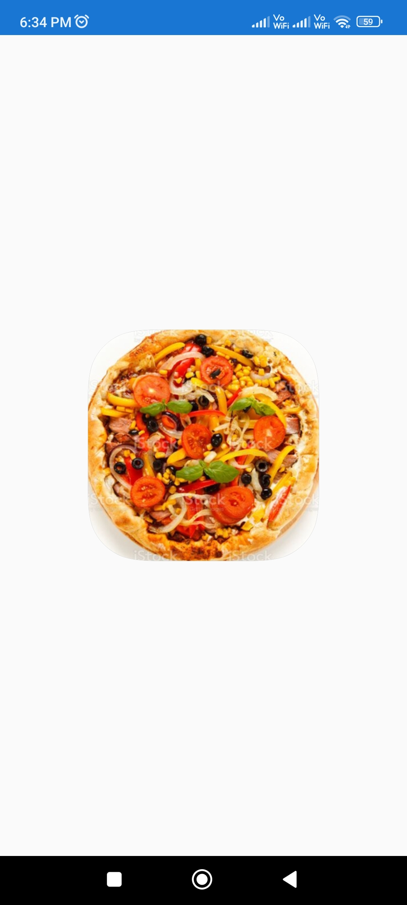
<br><br>
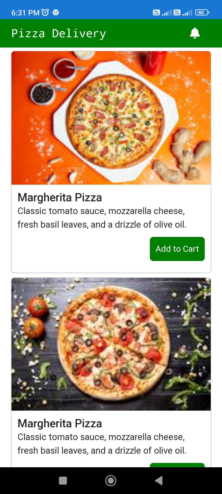

Now you can close all the opened applications and then go to the place where all of your Android or IOS app is present, you will find our Pizza-Delivery app also in the list along with other apps. Also, you will find the app Pizza-Delivery on your Home screen.
<br><br>
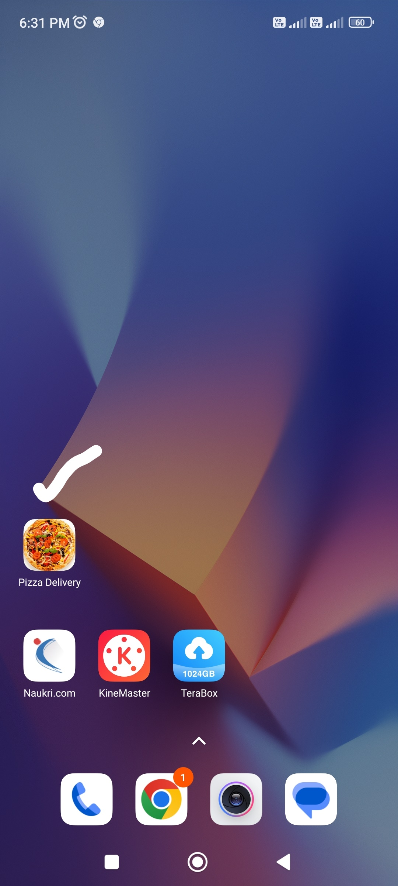

We have accomplished the Add to home screen feature.

<br><br>
**Offline Feature:**
<br>
Turn off your Mobile and Wifi data and try refreshing the app:
<br><br>


You will notice, you can still see the app working and the Pizza list that was coming from API is still available(Freshness Feature).
As we are using the strategy as Freshness, the API data is getting cached in our browser every time whenever we make an API call, and in the next calls, if the server is not responding then we are displaying the data from the cache.
In the ngsw-config.json file, we have specified the strategy.
We have accomplished the Offline support feature of the PWA app.

<br><br>
**Push Notifications Feature:**
<br>
Click on the Notification Icon in the top-right corner of the app.
<br><br>
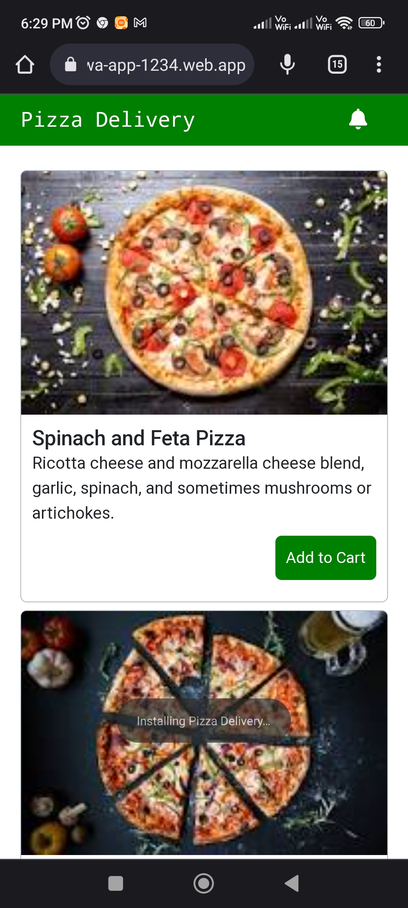

It will ask you to Enter your name which is an optional step. This is just to remember the user's name so that in the future we can serve the user better.
<br><br>
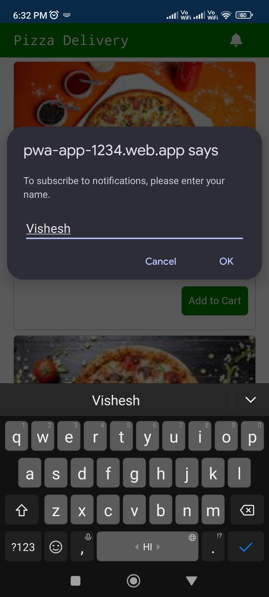

It will ask you for final confirmation
<br><br>
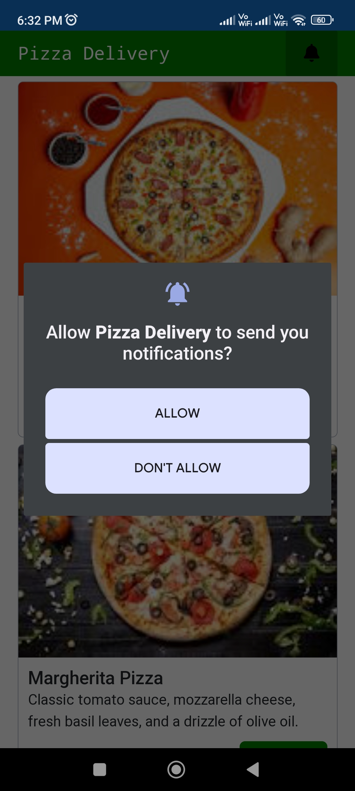

Upon clicking on Allow it will give you the below confirmation message:
<br><br>
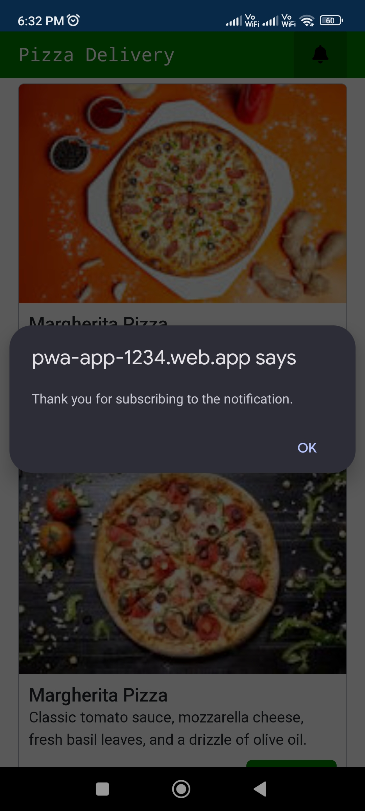

Now the app can receive the Push Notifications like below:
<br><br>
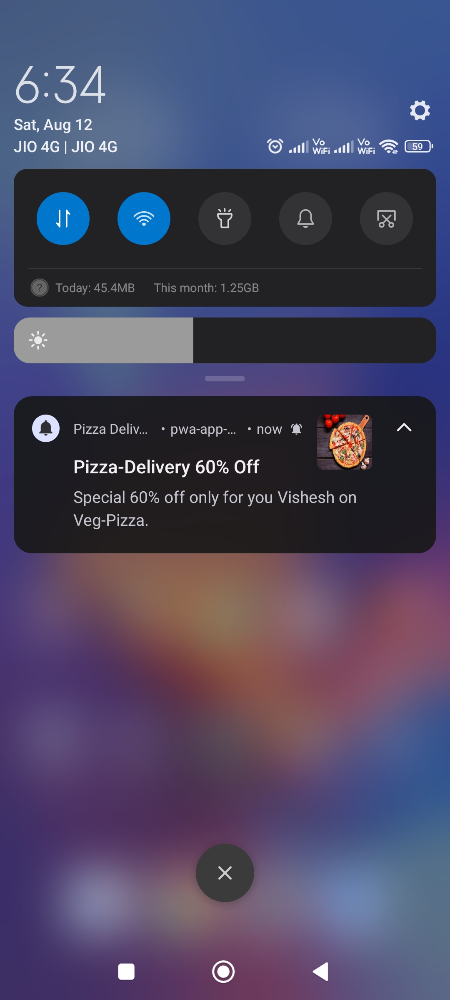

Upon clicking on the notification again the installed native app will open like the below:
<br><br>

<br><br>


<br><br>
**Code Structure:**
<br><br>


<br><br>
**POSTMAN APIs:**
<br><br>
You can get complete details about the APIs here https://github.com/vishesh-mahale/PWA-Firestore-CRUD-NodeJs-ExpressJS
<br>


<br><br>
## For generating manifest files and icons use:
https://manifest-gen.netlify.app/
